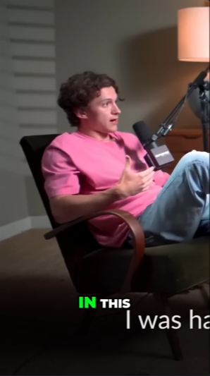

# AI shorts generator

  

A free open-source project designed to turn youtube-videos into viral short videos. Highlight detection, subtitles, translation, voiceover, all in one for your content: no pre-clip credits or any watermarks. Designed for creators who want an alternative to short-video SaaS tools like OpusClip or Vidyo.ai for free. 

## Examples of a  processed video
<table>
  <tr>
    <td align="center">
      <br>
      <sub><i>"The Speech that Made Obama President"</i></sub>
    </td>
    <td align="center">
      <br>
      <sub><i>"How Tom Overcame Social Anxiety - The Mindset That Changed Everything"</i></sub>
    </td>
    <td align="center">
      <br>
      <sub><i>"How to stay calm when you know you'll be stressed | Daniel Levitin | TED"</i></sub>
    </td>
  </tr>
</table>

# Features 🪁
- **API**: Freely use this generator in your own projects via our API.
- **Convenient**: Paste a YouTube link (any length!) and get a ready-to-post 9:16 short.
- **Hooks option**: When enabled, adds a context-aware AI-generated hook at the start of the clip
- **Web version**: Besides the CLI, you can also generate videos on a local website
- **Smart Highlight Selection**: Finds the most viral, hot moments from your video automatically based on algorithm

## How It Works

1. **Download**: Fetches the source video from YouTube, or uses the local file path directly
2. **Transcribe**: `faster-whisper` produces a timestamped transcript locally — same step regardless of which `LLM_PROVIDER` is selected
3. **Detect content type**: The chosen LLM classifies the video (podcast, interview, tutorial, vlog, etc.) and pacing, so the highlight prompt can be tuned per content style
4. **Highlight ranking**: The chosen LLM (`openai` / `gemini` / `muapi`) scans the transcript through a virality framework — hook moments, emotional peaks, opinion bombs, revelations, conflict, quotables, story peaks, practical value — and emits ranked candidates with scores 0–100
5. **Dedupe**: Overlapping candidates are collapsed by score
6. **Top-N selection**: The top `--n` candidates are selected
7. **Auto-crop**: Each highlight is rendered as a vertical short at the requested `--ratio`, with an optional AI-generated hook at the start unless `--no-hook` is set

# Requirements
- Python 3.10+
- Any LLM API key(OpenAI/Gemini/MuAPI)
- `requirements.txt` file dependencies

# Quick start
1. **Clone the repo:**

```bash
git clone https://github.com/Colafornia/short-video-generator-AI.git
cd short-video-generator-AI
```

2. **Create and activate a virtual environment:**

**Windows:**
```bash
python -m venv venv
venv\Scripts\activate
```
**Linux/MacOS:**
```bash
python -m venv venv
venv\Scripts\activate
```

3. **Install dependencies**
```bash
pip install -r requirements.txt
```

4. **Set up `.env`**
```env
# Used LLM provider(openai/gemini/MuAPI)
LLM_PROVIDER=openai

# Enter the API key for the chosen provider
OPENAI_API_KEY=your_openai_key_here
OPENAI_MODEL=gpt-4o-mini          # optional
GEMINI_API_KEY=your_gemini_key_here
GEMINI_MODEL=gemini-2.5-flash      # optional
MUAPI_API_KEY=your_muapi_key_here

# Whisper settings
LOCAL_WHISPER_MODEL=base # tiny / base / small / medium / large-v3
LOCAL_WHISPER_DEVICE=auto    # auto / cpu / cuda
```
If you uncertain about the provider:
| Provider | Free tier? | Get key |
|---|---|---|
| **Gemini** | ✅ Yes, but daily limit | https://aistudio.google.com |
| **OpenAI** | ❌ Paid | https://platform.openai.com |
| **MuAPI** | ❌ Paid, but pay-per-use, no subscription  | https://muapi.ai |

# Usage
Basic usage:

```bash
python main.py "https://www.youtube.com/watch?v=video_id" 
```


Renderred clips are saved to `output` folder

With flags:

```bash
python main.py "https://www.youtube.com/watch?v=video_id" \
      --n 3 \
      --ratio 9:16 \
      --resolution 1080 \
 ```
      
You can also provide a local video file instead of a YouTube link, for example:

```bash
python main.py "/Users/Admin/Folder/video.mp4" \
      --n 4 \
      --ratio 9:16 \
      --resolution 720 \
      --language zh \
```

## CLI Flags

| Flag | Default | Notes |
|------|---------|-------|
| --n | 3 | How many clips to render |
| --ratio | 9:16 | Any ratio / 9:16 for short videos / 1:1 for square |
| --resolution | 720 | Source video download resolution: `360` / `480` / `720` / `1080` |
| --language | auto | Force Whisper language code (e.g. `en`) |
| --no-hook | - | Excludes AI generated hook from the start of the  clip |


## Web version set-up
Instead of the CLI, you can use a local web interface to queue multiple videos at once and adjust flags visually. The LLM provider and API keys are still configured in `.env` — the web version only handles video input and render flags.

```bash
python3 server.py
```
Serve the frontend:

```bash
cd web
python3 -m http.server 8000
```
Then, open in your browser:

```bash
http://localhost:8000/shorts-generator-ui.html
```

## Contributing 

Feel free to open an issue or fork the repository for your projects.

## License

This project is licensed under the MIT License.
